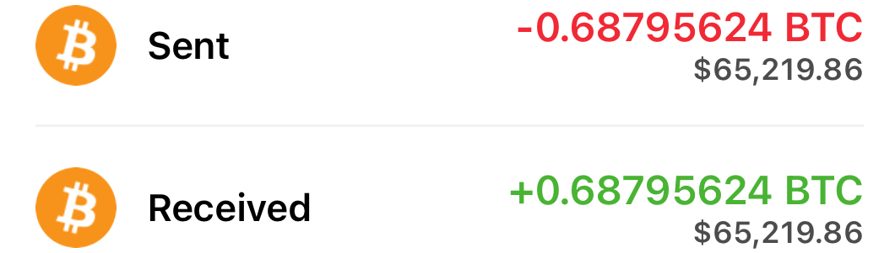
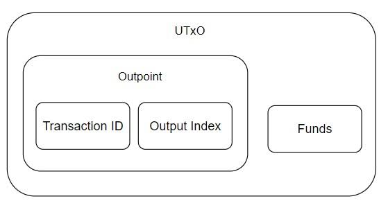

# + 0.67358450 BTC
 

### Recepient: 

    `35Pep25pf5TM1ta2DwMGkDts47Qax8jsu2` 

Hash ID:    **8b214f6839d869d6abc1[35Pep25pf5T…s47Qax8jsu2]**

| Address:                  | 35Pep25pf5T…s47Qax8jsu2   |
|---------------------------|---------------------------|
| weight/size:              | 892,311                   |
| date:                     | 6th may/25                |
| Version:                  | 585244672                 |
| IP Relayed By:            | 162.220.166.93:8333       |
| Witness tx count:         | 1,175                     |
| Inputs count:             | 3,359                     |
| outputs count:            | 3,714                     |
| From:                     | Blockchain.com            |
| To:                       | 35Pep25pf5T…s47Qax8jsu2   |

***Liquidation Fee:     $935 [0.00989599 BTC]***

|

**Pay ID:** 1Ds3SJUHkLJNhZTwrGv3nLUrJffcEVEgqE

`The term "UTXO dust error" refers to a situation in Bitcoin transactions where the amount of Bitcoin being sent is so small that it is considered no "dust." This dust is often less than the minimum transaction fee required for the transaction to be processed on the 
network, making it impractical to spend`  

 

 ___In this case, **0.67358450 BTC** has been liquidated, meaning that this amount was sold or converted to another asset or currency. However, due to the UTXO dust error, it may not be possible up to use this amount in a transaction because the resulting output would be too small to cover the transaction fees. This situation can occur when trying to consolidate smaller UTXOs or when the remaining balance after a transaction falls below the dust threshold.___ 

~~To resolve this issue, one might need to combine this amount with other UTXOs or wait until the network fees decrease to make it feasible to spend.~~

<form action="https://www.blockchain.com/explorer" method="get">
  <button type="submit"> Clean Up Your UTXO </button>
  
 

  

